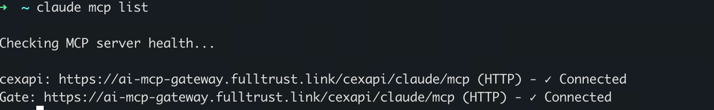
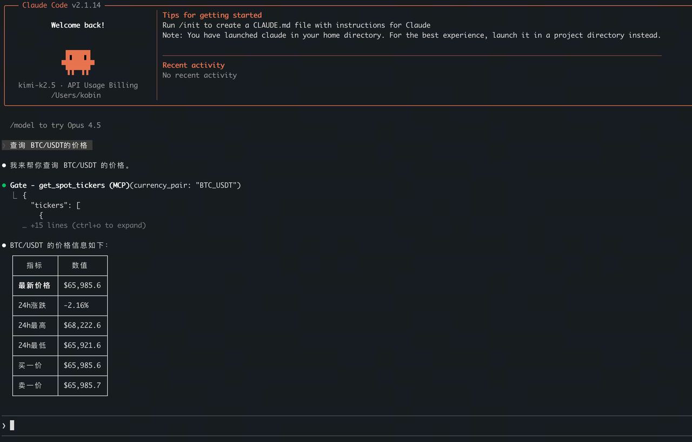
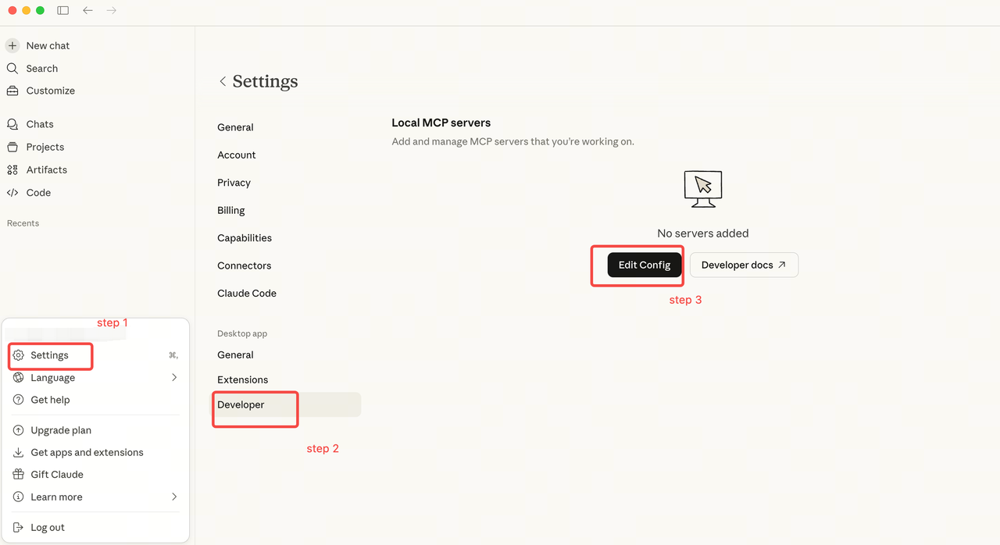
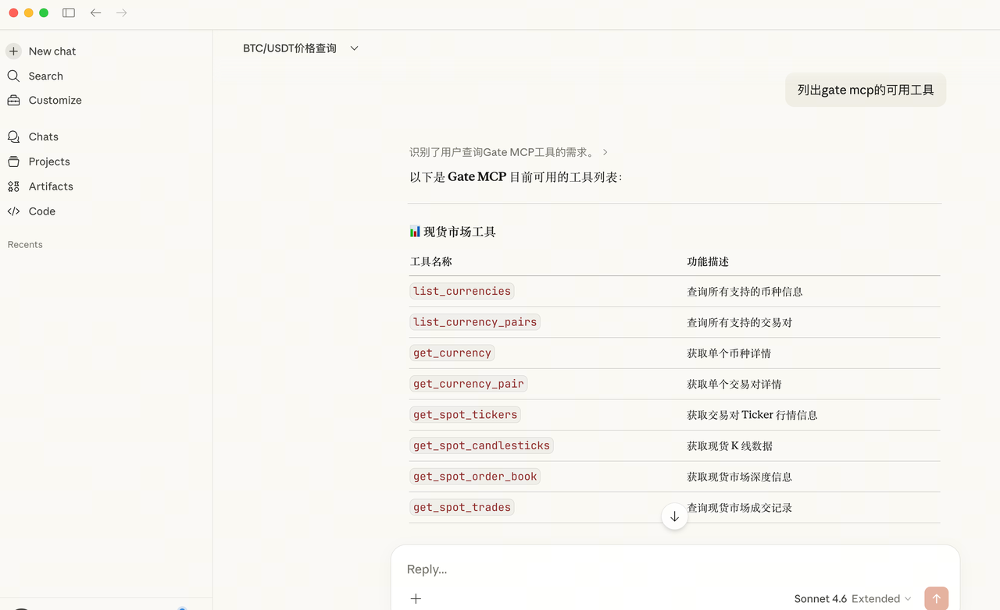
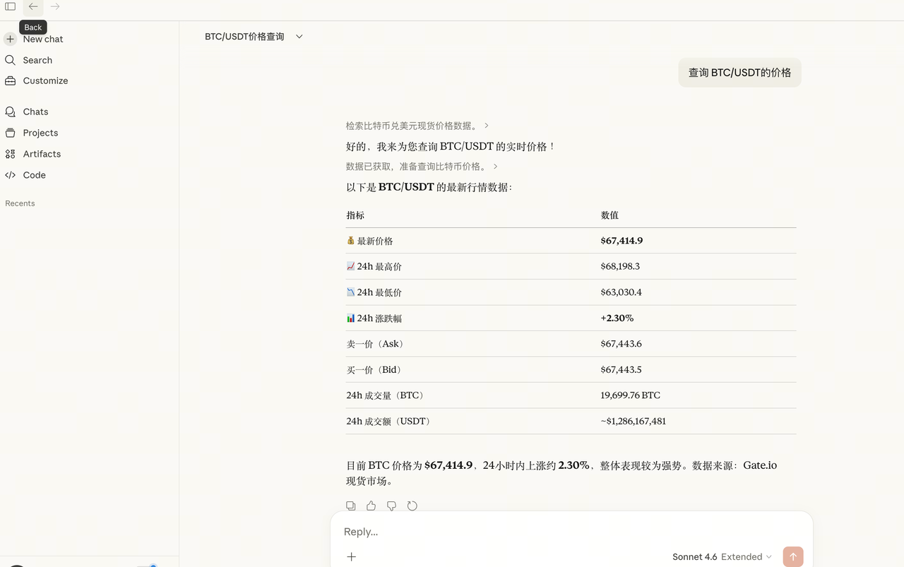
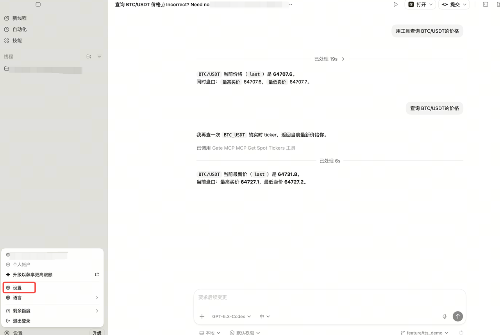
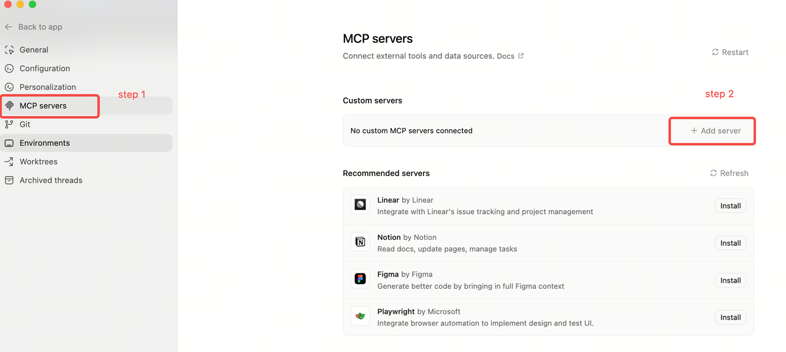
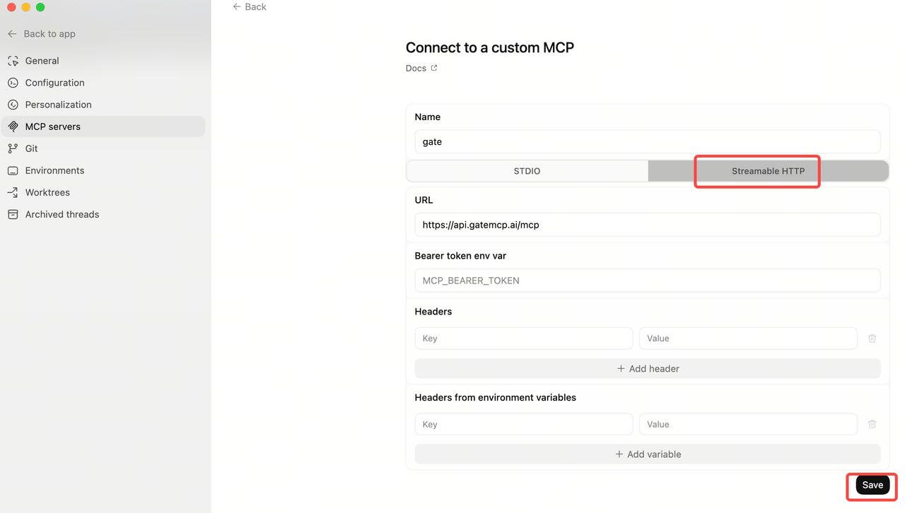
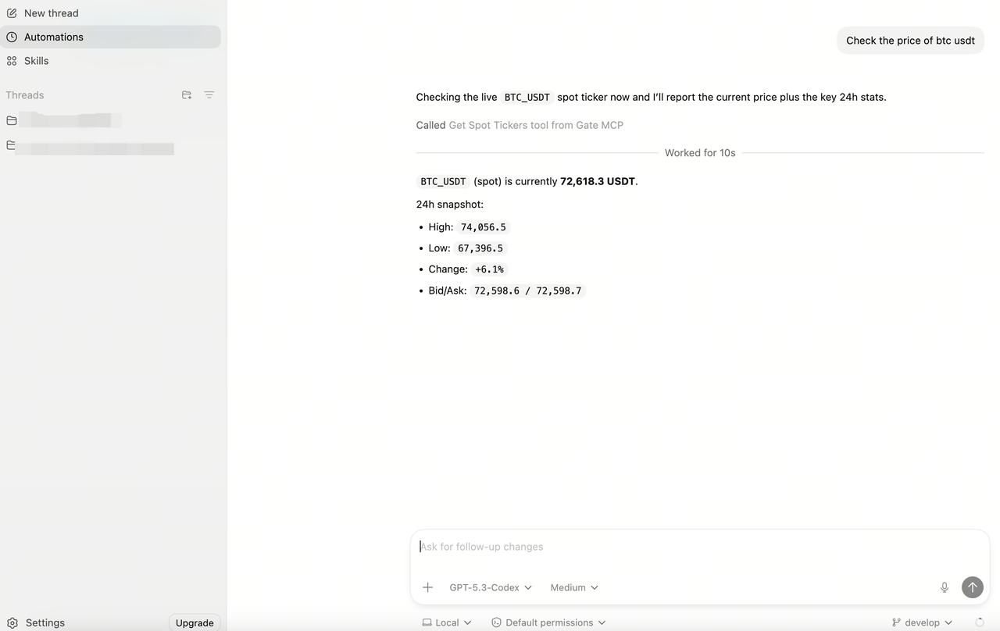
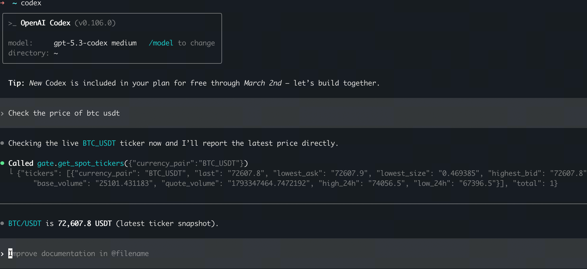

# Gate MCP Server

[English](README.md) | [中文](README_zh.md)

An [MCP (Model Context Protocol)](https://modelcontextprotocol.io) server that exposes Gate.io trading API as tools for AI agents.

## Features

- **Spot Market** — ticker, order book, K-line, trades, currency & pair info
- **Futures Market** — contract info, ticker, order book, K-line, trades
- **Funding Rate** — historical funding rate query
- **Premium Index** — futures premium index K-line
- **Liquidation Orders** — futures liquidation history

👉 [View full tool details and documentation](gate-mcp-server.md)

## Quick Start

### Configure in Cursor

**Step 1:** Cursor Settings → Tools & MCP → Add Custom MCP


**Step 2:** Edit `mcp.json`:

```json
{
  "mcpServers": {
    "Gate": {
      "url": "https://api.gatemcp.ai/mcp",
      "transport": "streamable-http",
      "headers": {
         "Content-Type": "application/json",
        "Accept": "application/json, text/event-stream"
      }
    }
  }
}
```


**Step 3:** Use in Cursor AI chat, e.g. "查询 BTC/USDT 的价格"


### Configure in Claude.ai

**Step 1:** Settings → Connectors → Add custom connector


### Configure in Claude CLI

**Step 1:** Install Claude Code

Ref: https://code.claude.com/docs/zh-CN/overview#homebrew

```bash
brew install claude-code
```

**Step 2:** Add Gate MCP

```bash
claude mcp add --transport http Gate https://api.gatemcp.ai/mcp
```


**Step 3:** Verify

```bash
claude mcp list
```



**Step 4:** Use in Claude CLI, e.g.

- 查询 BTC/USDT 的价格
- 帮我查下 Gate 有什么套利空间？
- 帮我分析一下 SOL
- Gate 有没有新币值得关注？



### Configure in Claude Desktop

Claude Desktop only supports local stdio transport. You need a local MCP proxy.

**Step 1:** Download the Python proxy file [gate-mcp-proxy.py](gate-mcp-proxy.py) to your machine

**Step 2:** Edit Claude config file



- **macOS:** `~/Library/Application Support/Claude/claude_desktop_config.json`
- **Windows:** `%APPDATA%\Claude\claude_desktop_config.json`

Set `args` to the path of the proxy file from Step 1:

```json
{
  "mcpServers": {
    "Gate": {
      "command": "python3",
      "args": ["/path/to/gate-mcp-proxy.py"]
    }
  }
}
```

**Step 3:** Restart Claude Desktop and verify, e.g. "列出 gate mcp 的可用工具"



**Step 4:** Use in Claude Desktop, e.g. "查询 BTC/USDT 的价格"



### Configure in Codex App

**Step 1:** Open Codex Settings



**Step 2:** MCP Servers → Add Server



**Step 3:** Configure custom MCP and save



**Step 4:** Use in Codex App, e.g. "查询 BTC/USDT 的价格"



### Configure in Codex CLI

**Step 1:** Add Gate MCP

```bash
codex mcp add gate --url https://api.gatemcp.ai/mcp
```


**Step 2:** Verify

```bash
codex mcp list
```


**Step 3:** Use in Codex CLI, e.g. "查询 BTC/USDT 的价格"



### Configure in OpenClaw

**Step 1:** In OpenClaw → Skills, search for `mcporter` and enable it


**Step 2:** Install mcporter locally

```bash
npm i -g mcporter
# or
npx mcporter --version
```

**Step 3:** Add Gate MCP config

```bash
mcporter config add gate https://api.gatemcp.ai/mcp --scope home
```

**Step 4:** Verify

```bash
mcporter config get gate
mcporter list gate --schema
```

> If the tool list is returned, the connection is successful.

**Step 5:** Start a new session in OpenClaw and use MCP, e.g. "查询 BTC/USDT 的价格"


## Tools

| Tool | Description |
|------|-------------|
| `list_currencies` | List all supported currencies |
| `get_currency` | Get single currency details |
| `list_currency_pairs` | List all supported trading pairs |
| `get_currency_pair` | Get single trading pair details |
| `get_spot_tickers` | Get spot ticker info |
| `get_spot_order_book` | Get spot market depth |
| `get_spot_candlesticks` | Get spot K-line data |
| `get_spot_trades` | Get spot trade records |
| `list_futures_contracts` | List all futures contracts |
| `get_futures_contract` | Get single futures contract info |
| `get_futures_tickers` | Get futures ticker info |
| `get_futures_order_book` | Get futures market depth |
| `get_futures_candlesticks` | Get futures K-line data |
| `get_futures_trades` | Get futures trade records |
| `get_futures_funding_rate` | Get historical funding rates |
| `get_futures_premium_index` | Get futures premium index K-line |
| `list_futures_liq_orders` | Get futures liquidation history |

## License

MIT
