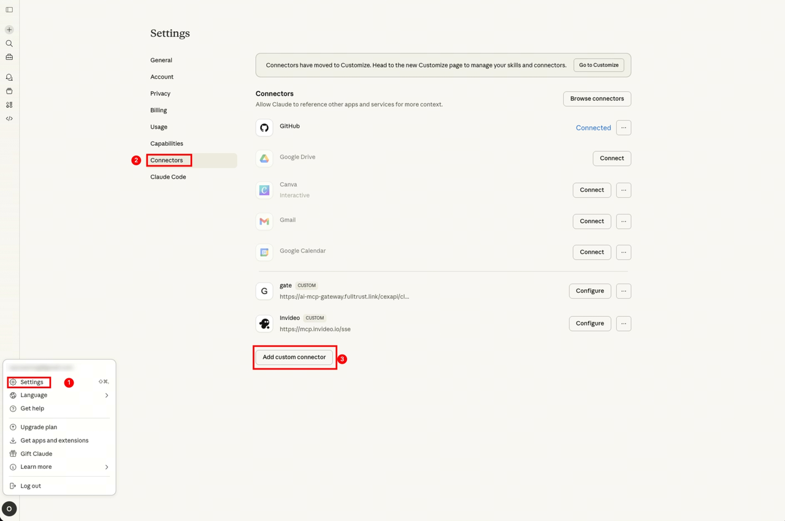

# Claude.ai 配置指南

## 前置条件

- 一个有效的 Claude.ai 账号（Pro 或 Enterprise）

## 第 1 步：打开 Claude.ai 设置

导航到 **Settings** → **Connectors** → **Add custom connector**

## 第 2 步：配置 MCP 连接器

1. **名称**：输入 "Gate MCP" 或你喜欢的名称
2. **URL**：输入 `https://api.gatemcp.ai/mcp`
3. **传输方式**：选择 `streamable-http`

## 第 3 步：保存并验证

点击 **Save** 添加连接器。你应该能在连接器列表中看到它。

要验证是否正常工作：

1. 在 Claude.ai 中开始新对话
2. 尝试："列出 Gate MCP 的可用工具"

## 故障排除

### 连接器无法保存

- 检查 URL 是否正确
- 验证你是否有必要的权限
- 尝试刷新页面后重试

### 工具不可用

- 检查连接器是否已启用
- 尝试移除并重新添加连接器
- 检查你的 Claude.ai 套餐是否支持自定义连接器

## 下一步

- 探索所有[可用工具](../README_zh.md#工具列表)
- 了解[合约市场工具](../README_zh.md#合约市场)
- 查看 [API 文档](https://www.gate.io/docs/developers/apiv4/)
