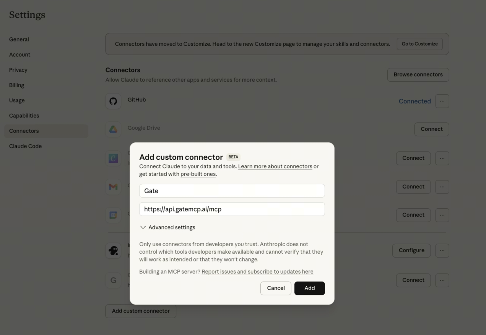
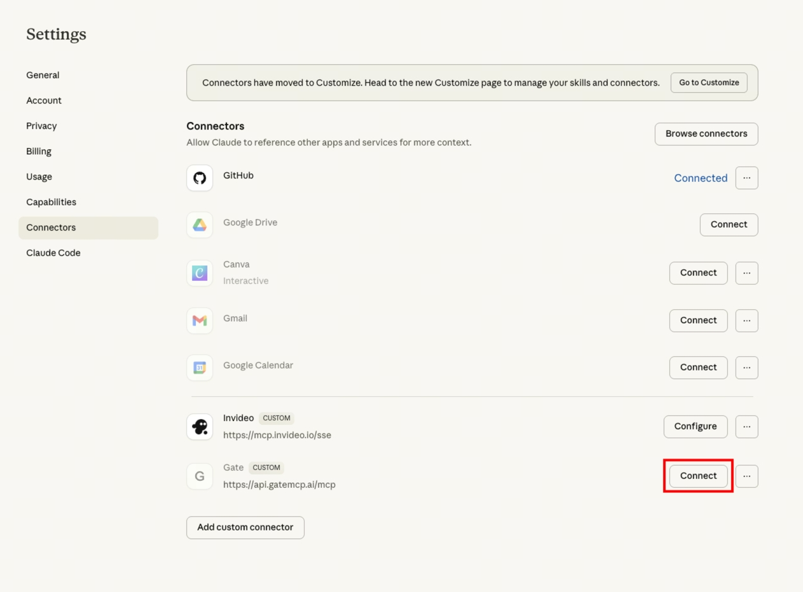
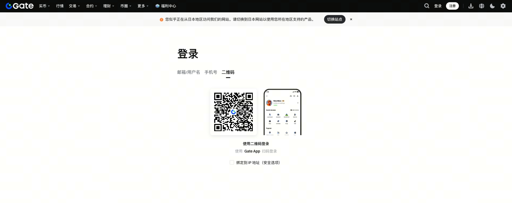
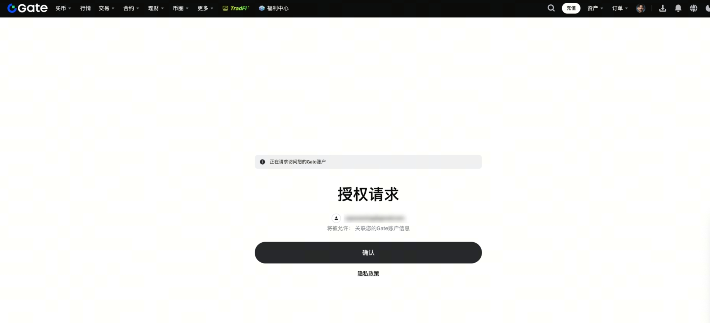
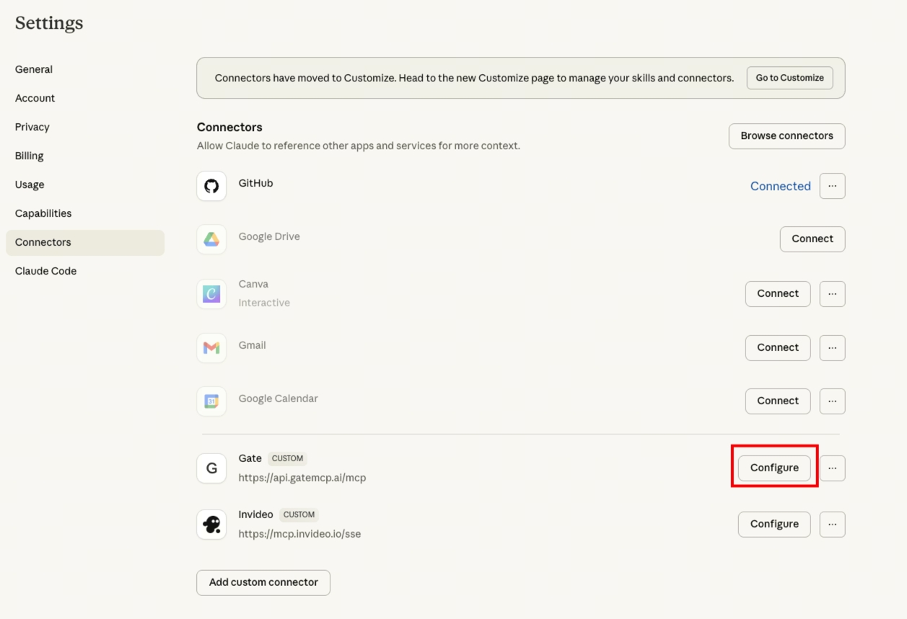

# Claude.ai Setup Guide

## Prerequisites

- An active Claude.ai account (Pro or Enterprise)

## Step 1: Open Claude.ai Settings

Navigate to **Settings** → **Connectors** → **Add custom connector**

## Step 2: Configure the MCP Connector

1. **Name**: Enter "Gate MCP" or your preferred name
2. **URL**: Enter `https://api.gatemcp.ai/mcp` (market data, no auth) or `https://api.gatemcp.ai/mcp/exchange` (full trading, OAuth)
3. **Transport**: Select `streamable-http`

## Step 3: Save and Verify

Click **Save** to add the connector. You should see it listed in your connectors.

To verify it's working:

1. Start a new conversation in Claude.ai

2. Try: "BTC market data"

## Troubleshooting

### Connector Not Saving

- Check if the URL is correct
- Verify you have the necessary permissions
- Try refreshing the page and trying again

### Tools Not Available

- Check if the connector is enabled
- Try removing and re-adding the connector
- Check if your Claude.ai plan supports custom connectors

## Next Steps

- Explore all [available tools](../README.md#available-tools)
- Learn about [futures market tools](../README.md#public-mcp-mcp--no-auth)
- Check the [API documentation](https://www.gate.com/docs/developers/apiv4/)
