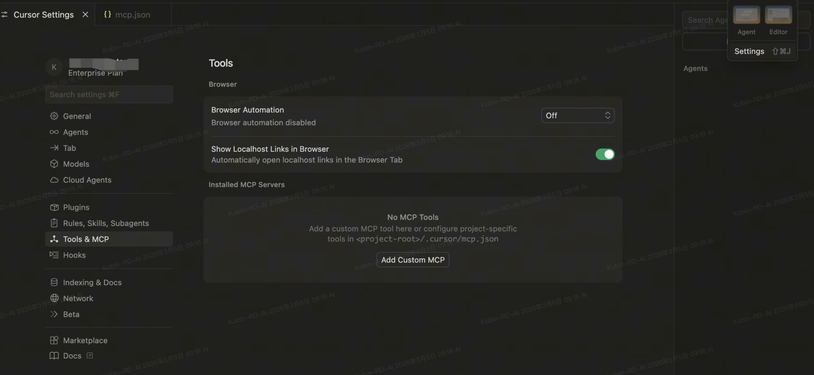
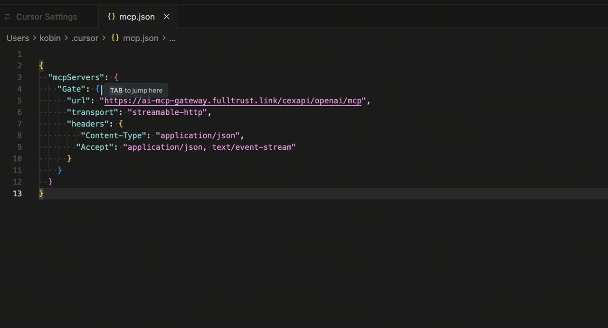
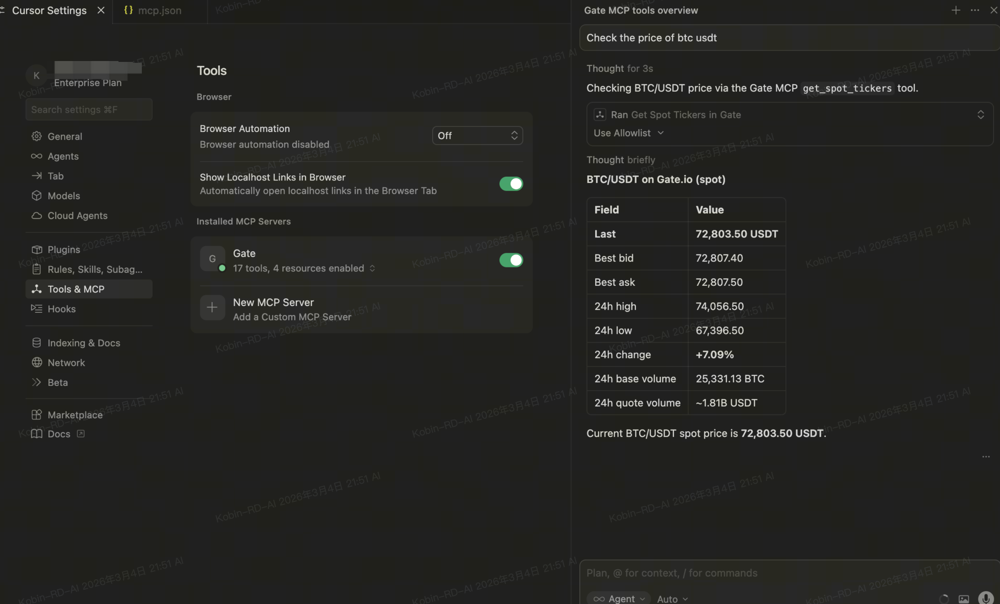

# Cursor 配置指南

Gate MCP 提供两个端点，按需选择：

| 端点 | 认证 | 用途 |
|------|------|------|
| `https://api.gatemcp.ai/mcp` | 无 | 仅市场数据（行情、深度、K 线等） |
| `https://api.gatemcp.ai/mcp/exchange` | OAuth2 | 完整功能（交易、余额、划转 — 连接时 OAuth 登录） |

## 第 1 步：打开 Cursor 设置

导航到 `Settings` → `Tools & MCP` → `Add Custom MCP`



## 第 2 步：编辑 MCP 配置

编辑你的 `mcp.json` 文件。

**完整交易能力（连接时 OAuth 登录）：**

```json
{
  "mcpServers": {
    "Gate": {
      "url": "https://api.gatemcp.ai/mcp/exchange",
      "transport": "streamable-http",
      "headers": {
        "Content-Type": "application/json",
        "Accept": "application/json, text/event-stream"
      }
    }
  }
}
```

**仅查行情（无需认证）：**

```json
{
  "mcpServers": {
    "Gate": {
      "url": "https://api.gatemcp.ai/mcp",
      "transport": "streamable-http",
      "headers": {
        "Content-Type": "application/json",
        "Accept": "application/json, text/event-stream"
      }
    }
  }
}
```



## 第 3 步：开始使用

打开 Cursor AI 对话，尝试：

- "查询 BTC/USDT 的当前价格"
- "显示 ETH/USDT 的订单簿"
- "获取 SOL/USDT 的 1 小时 K 线数据"



## 故障排除

### 连接问题

1. 检查网络连接
2. 验证 MCP 服务器 URL 是否正确
3. 查看 Cursor 的 MCP 日志获取错误信息

### 工具不可用

1. 确保 MCP 配置正确保存
2. 重启 Cursor
3. 检查 MCP 服务器是否可访问

## 下一步

- 探索所有[可用工具](../README_zh.md#工具列表)
- 了解[合约工具](../README_zh.md#public-mcpmcp--无需认证)
- 查看 [API 文档](https://www.gate.com/docs/developers/apiv4/)
