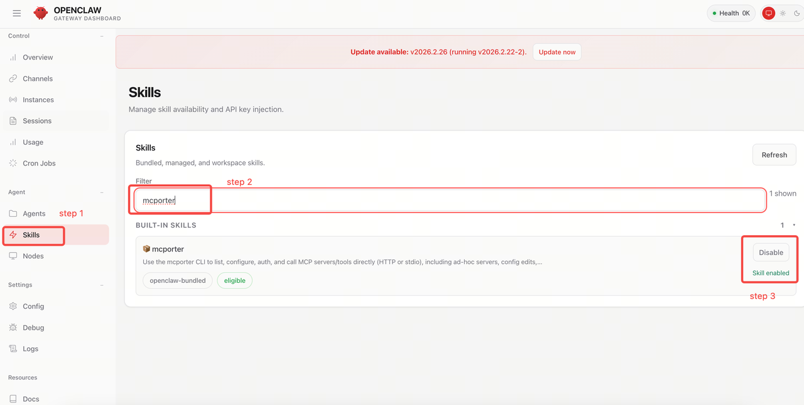
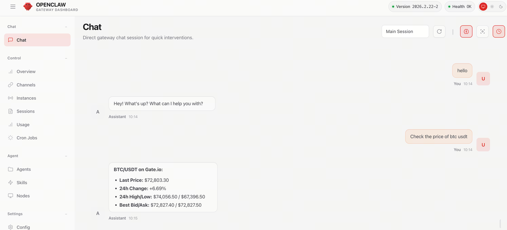

# OpenClaw 配置指南

## 前置条件

- 已安装 OpenClaw（访问 [openclaw.io](https://openclaw.io)）
- Node.js >= 18

## 第 1 步：启用 mcporter Skill

在 OpenClaw 中，导航到 **Skills** 并搜索 `mcporter`。启用它。



## 第 2 步：本地安装 mcporter

全局安装 mcporter CLI 工具：

```bash
npm install -g mcporter
```

或使用 npx 运行而无需安装：

```bash
npx mcporter --version
```

## 第 3 步：添加 Gate MCP 配置

添加 Gate MCP 服务器配置：

```bash
mcporter config add gate https://api.gatemcp.ai/mcp --scope home
```

这将配置保存到你的主目录。

## 第 4 步：验证连接

检查配置：

```bash
mcporter config get gate
```

列出可用工具：

```bash
mcporter list gate --schema
```

> 如果能返回工具列表，说明连接成功。

## 第 5 步：在 OpenClaw 中使用

1. 在 OpenClaw 中开始新会话
2. mcporter skill 应该会自动检测并使用 Gate MCP 配置
3. 尝试："BTC/USDT 的当前价格是多少？"



## 管理配置

### 列出所有配置

```bash
mcporter config list
```

### 移除配置

```bash
mcporter config remove gate
```

### 更新配置

```bash
mcporter config add gate https://api.gatemcp.ai/mcp --scope home --force
```

## 故障排除

### mcporter 未找到

确保 mcporter 已安装并在你的 PATH 中：

```bash
which mcporter
# 或
npx mcporter --version
```

### 配置无法保存

检查你是否有配置目录的写入权限：

```bash
mcporter config list --verbose
```

### 连接失败

1. 验证 URL：`https://api.gatemcp.ai/mcp`
2. 检查网络连接
3. 尝试直接在浏览器中访问该 URL

## 下一步

- 探索所有[可用工具](../README_zh.md#工具列表)
- 了解[合约市场工具](../README_zh.md#合约市场)
- 查看 [API 文档](https://www.gate.io/docs/developers/apiv4/)
