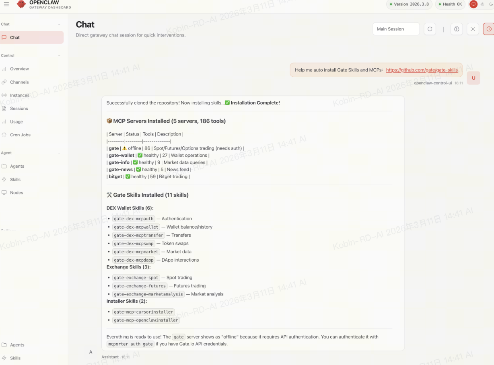

# OpenClaw Setup Guide

## Method 1: One-click Install

In the AI chat, type:

> Help me auto install Gate Skills and MCPs: https://github.com/gateio/gate-skills



## Method 2: Manual Configuration

Gate provides two ways to connect MCP in OpenClaw:

| Method | Description | Auth | Tools |
|--------|-------------|------|-------|
| **Local MCP** (Recommended) | Run locally via `npx gate-mcp`, supports API Key auth | API Key | 384 tools (22 modules) |
| **Remote MCP** (via mcporter) | Connect to remote server, supports OAuth2 | OAuth2 | 17 public / 66 private |

## Prerequisites

- OpenClaw installed (visit [openclaw.io](https://openclaw.io))
- Node.js >= 18
- Gate API Key & Secret (for trading via Local MCP) or Gate account (for OAuth via Remote MCP)

---

## Option A: Local MCP (Recommended)

> Uses [gate-local-mcp](https://github.com/gate/gate-local-mcp) — a local stdio MCP server via `npx gate-mcp`. By default it registers **384 tools** across **22 modules** (spot, futures, delivery, margin, wallet, account, options, earn, flash_swap, unified, sub_account, multi_collateral_loan, p2p, tradfi, crossex, alpha, rebate, activity, coupon, launch, square, welfare). Tool names exposed to MCP use abbreviations (`futures`→`fx`, `delivery`→`dc`, etc.); see the canonical list in [gate-local-mcp-tools.md](../gate-exchange/gate-local-mcp-tools.md).

### Step 1: Create Gate API Key (for trading)

> Skip this step if you only need market data (no auth required for public endpoints).

1. Register or log in to your [Gate.io](https://www.gate.com) account
2. Go to [API Key Management](https://www.gate.com/myaccount/profile/api-key/manage)
3. Click **Create API Key**, set permissions (e.g., Spot Trade, Futures Trade, Wallet), and save your **API Key** and **API Secret**

> **Important:** Store your API Secret securely — it is only shown once. For detailed API documentation, see [Gate API Docs](https://www.gate.com/docs/developers/apiv4/en/).

### Step 2: Configure in OpenClaw

Edit your OpenClaw MCP configuration:

**Market data only (no auth):**

```json
{
  "mcpServers": {
    "gate": {
      "command": "npx",
      "args": ["-y", "gate-mcp"]
    }
  }
}
```

**With trading (API Key):**

```json
{
  "mcpServers": {
    "gate": {
      "command": "npx",
      "args": ["-y", "gate-mcp"],
      "env": {
        "GATE_API_KEY": "your-api-key",
        "GATE_API_SECRET": "your-api-secret"
      }
    }
  }
}
```

**Testnet:**

```json
{
  "mcpServers": {
    "gate": {
      "command": "npx",
      "args": ["-y", "gate-mcp"],
      "env": {
        "GATE_BASE_URL": "https://api-testnet.gateapi.io",
        "GATE_API_KEY": "your-testnet-key",
        "GATE_API_SECRET": "your-testnet-secret"
      }
    }
  }
}
```

### Step 3: Module Filtering (Optional)

By default all 384 tools (22 modules) are loaded. To reduce tool count, use `GATE_MODULES` and `GATE_READONLY`:

```json
{
  "mcpServers": {
    "gate": {
      "command": "npx",
      "args": ["-y", "gate-mcp"],
      "env": {
        "GATE_MODULES": "spot,futures",
        "GATE_READONLY": "true",
        "GATE_API_KEY": "your-api-key",
        "GATE_API_SECRET": "your-api-secret"
      }
    }
  }
}
```

| Environment Variable | Description |
|---------------------|-------------|
| `GATE_API_KEY` | Gate API Key (enables trading tools) |
| `GATE_API_SECRET` | Gate API Secret |
| `GATE_BASE_URL` | Override API endpoint (e.g., testnet) |
| `GATE_MODULES` | Comma-separated module list: `spot`, `futures`, `delivery`, `margin`, `wallet`, `account`, `options`, `earn`, `flash_swap`, `unified`, `sub_account`, `multi_collateral_loan`, `p2p`, `tradfi`, `crossex`, `alpha`, `rebate`, `activity`, `coupon`, `launch`, `square`, `welfare` |
| `GATE_READONLY` | Set to `true` to disable write operations |

### Step 4: Start Using

1. Start a new session in OpenClaw
2. Try: "What is the current price of BTC/USDT?"

For more details, see the [gate-local-mcp repository](https://github.com/gate/gate-local-mcp) and the [wire-level tool list](../gate-exchange/gate-local-mcp-tools.md).

---

## Option B: Remote MCP (via mcporter)

> Connects to the remote Gate MCP server (`api.gatemcp.ai`). Uses OAuth2 for authentication.

### Step 1: Enable mcporter Skill

In OpenClaw, navigate to **Skills** and search for `mcporter`. Enable it.


### Step 2: Install mcporter Locally

```bash
npm install -g mcporter
```

Or use npx to run without installing:

```bash
npx mcporter --version
```

### Step 3: Add Gate MCP Configuration

**For full trading (OAuth):**

```bash
mcporter config add gate-mcp --url https://api.gatemcp.ai/mcp/exchange --auth oauth
```

**For market data only (no auth):**

```bash
mcporter config add gate-mcp --url https://api.gatemcp.ai/mcp
```

**For DEX (on-chain wallet, swap):**

```bash
mcporter config add gate-dex --url https://api.gatemcp.ai/mcp/dex
```

**For Info (no auth):**

```bash
mcporter config add gate-info --url https://api.gatemcp.ai/mcp/info
```

**For News (no auth):**

```bash
mcporter config add gate-news --url https://api.gatemcp.ai/mcp/news
```

### Step 4: Authorize (only for `/mcp/exchange`)

Log in with your Gate account (opens browser):

```bash
mcporter auth gate-mcp
```

### Step 5: Verify the Connection

```bash
mcporter config get gate-mcp
mcporter list gate-mcp --schema
```

> If the tool list is returned, the connection is successful.

### Step 6: Use in OpenClaw

1. Start a new session in OpenClaw
2. The mcporter skill should automatically detect and use the Gate MCP configuration
3. Try: "What is the current price of BTC/USDT?"


### Managing Configurations

```bash
# List all configurations
mcporter config list

# Remove a configuration
mcporter config remove gate-mcp

# Update a configuration
mcporter config add gate-mcp --url https://api.gatemcp.ai/mcp/exchange --auth oauth --force
```

---

## Troubleshooting

### npx / mcporter Not Found

Make sure Node.js >= 18 and npm are installed:

```bash
node -v
npm -v
```

### Connection Failed

1. **Local MCP**: Verify `npx gate-mcp` runs without errors
2. **Remote MCP**: Verify the URL `https://api.gatemcp.ai/mcp/exchange` or `https://api.gatemcp.ai/mcp` is accessible
3. Check your internet connection

## Next Steps

- Explore all [available tools](../README.md#available-tools)
- Learn about [gate-local-mcp](https://github.com/gate/gate-local-mcp) for full local setup details
- Check the [API documentation](https://www.gate.com/docs/developers/apiv4/)
